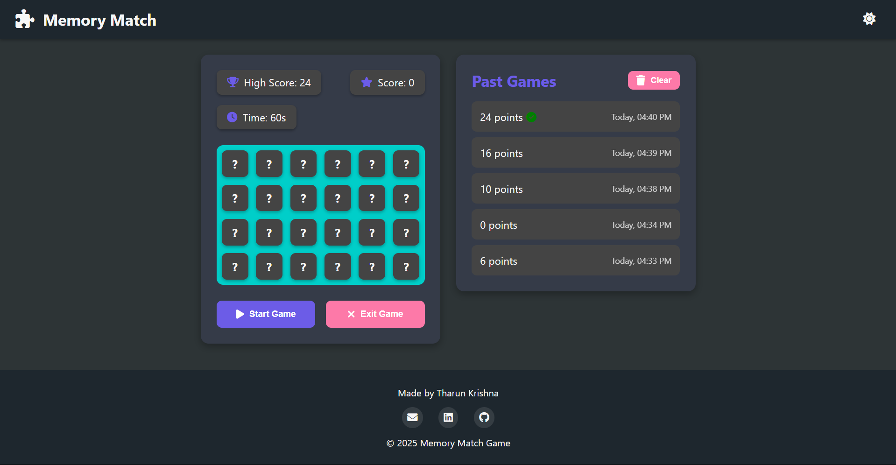
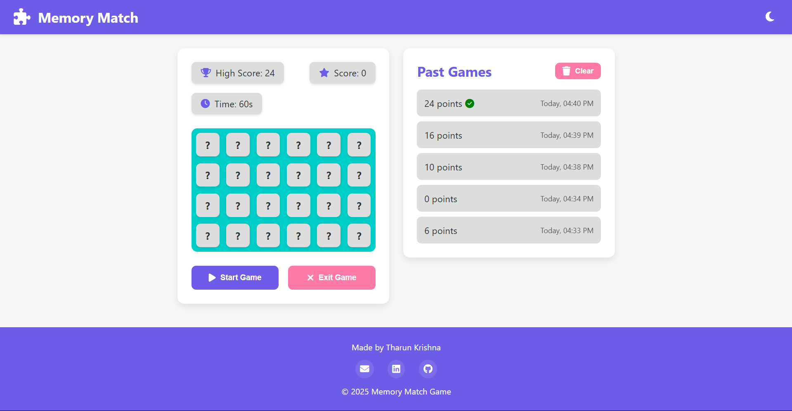
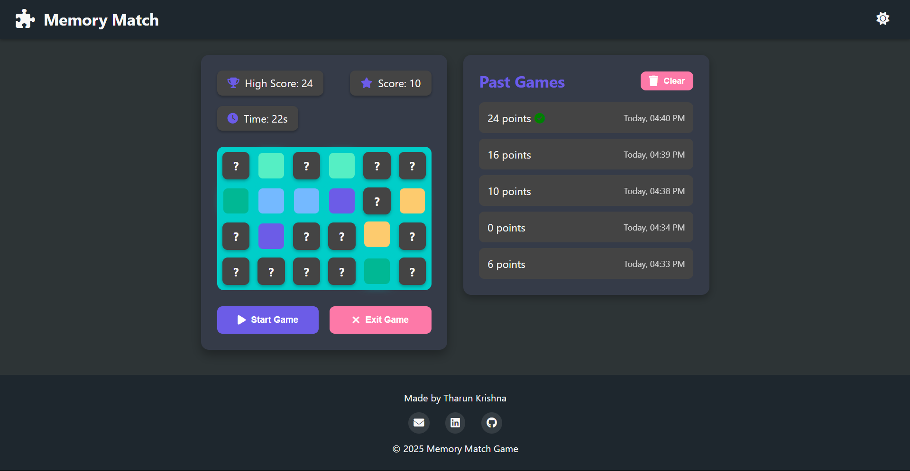
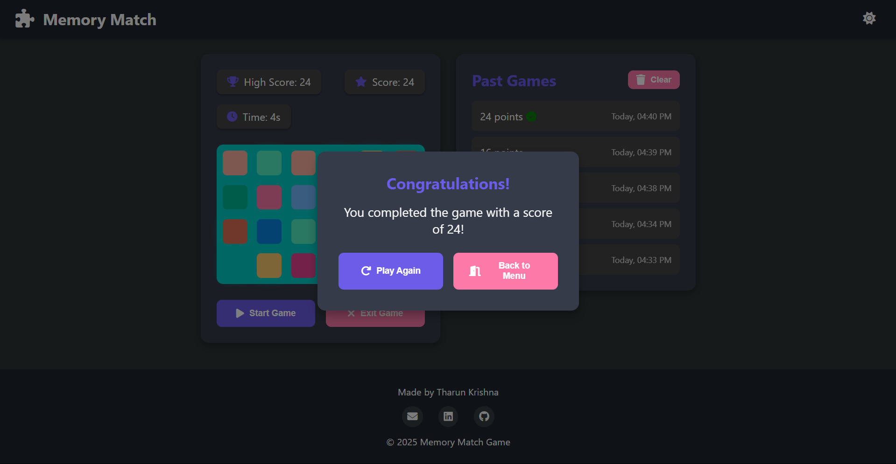
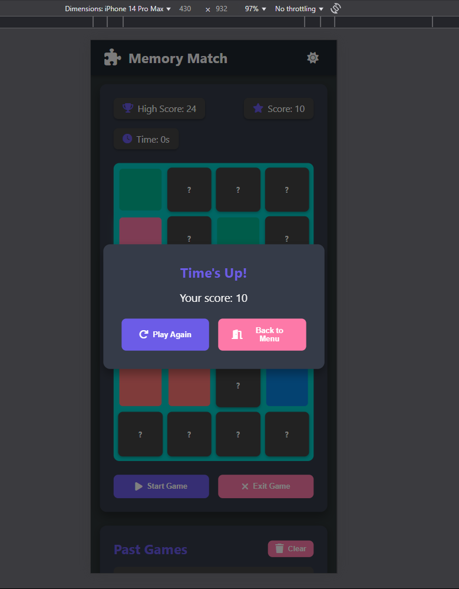

# Memory Match Game

A responsive memory card matching game with light/dark theme support and score tracking. Test your memory by matching pairs of colored cards before time runs out!

---

## Features

- 🎮 Classic memory matching gameplay
- 🌓 Light and dark theme support
- 📱 Fully responsive design that works on all devices
- 💾 LocalStorage for saving game data
- 📊 Game history scoreboard and Timeout⏰

---

## 🛠️ Built With

- **HTML5** – Semantic structure  
- **CSS3** – Theming with CSS variables, animations  
- **JavaScript (ES6+)** – Game logic and interactivity  
- **LocalStorage API** – Score & history tracking  
- **Font Awesome** – Iconography  

---

## Screenshots







## How to Play

1. Click the "Start Game" button to begin
2. Find matching pairs of colored cards by clicking on them
3. Match all pairs before the timer runs out
4. Your score is tracked and saved
5. Try to beat your high score!

## Technologies Used

- HTML5
- CSS3 (with CSS Variables for theming)
- Vanilla JavaScript (ES6+)
- LocalStorage API for data persistence
- Font Awesome icons

## Installation

1. Clone this repository:
```
git clone https://github.com/your-username/memory-match-game.git
```

2. Navigate to the project directory:
```
cd memory-match-game
```

3. Open `index.html` in your browser to play the game.

## Customization

You can customize the game by modifying the following:

- `TIME` constant in `script.js` to change the game duration
- `COLORS` array in `script.js` to change the card colors
- CSS variables in `styles.css` to modify the theme colors

---

## 🙌 Contributing

We welcome contributions! Whether it’s fixing bugs, improving UI, or adding a cool new game mode, you’re welcome to join in!

### 💡 Ways You Can Contribute:
- Fix typos or improve the layout
- Suggest UI/UX enhancements
- Add more game modes or animations
- Optimize the JS logic or add accessibility features

Just fork the repo, make your changes, and open a pull request. Let’s make this better together! 💪

---

## 📬 Contact

<p align="center">
  <a href="mailto:tharun151425@gmail.com"></a>
  <a href="https://www.linkedin.com/in/tharunkrishna-m/"></a>
  <a href="https://github.com/Tharun151425"></a>
</p>

> Built by **Tharunkrishna M** — Keep matching, keep winning!
---